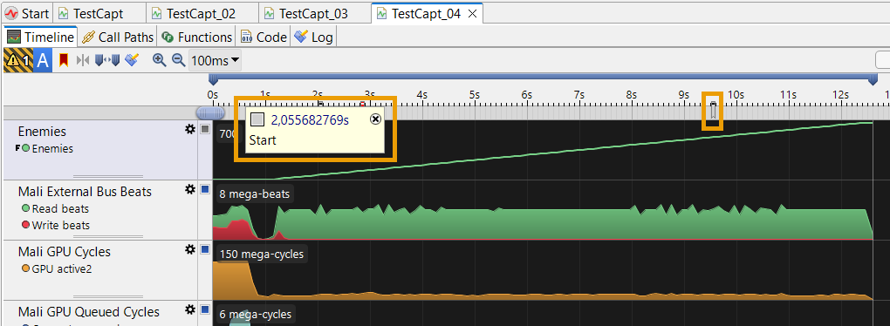
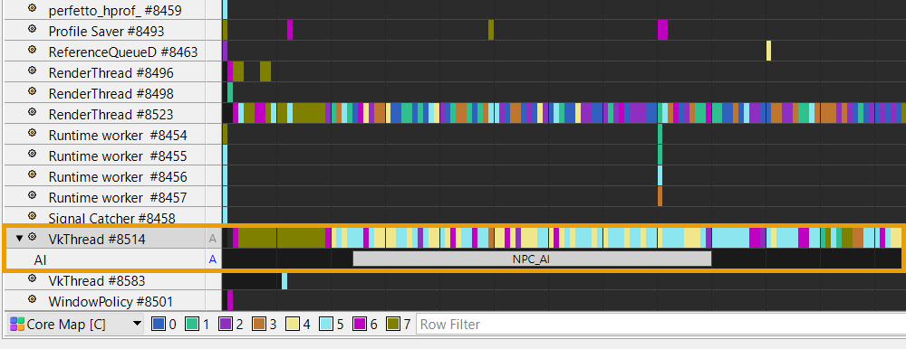
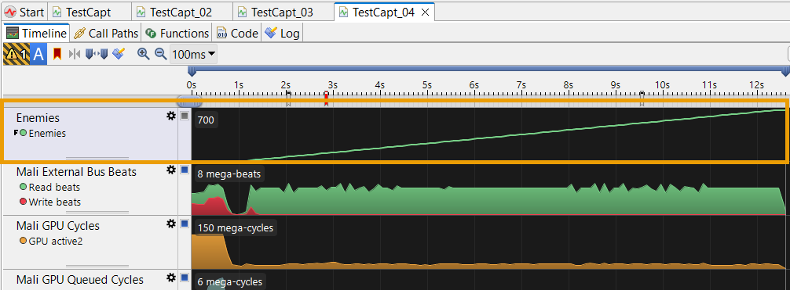
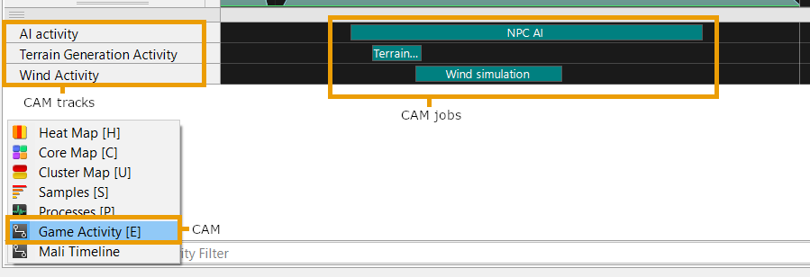

Godot Bindings for Arm Performance Studio
=========================================

Introduction
------------

Arm Performance Studio includes a component called Streamline, which can collect
and present hardware performance counters from Android devices. Streamline has
an *annotations* feature, which allows the application being profiled to emit
additional information that Streamline displays with the captured performance
counter information.

Installation
------------

Arm Performance Studio integration in Godot is implemented as an extension. To
install it, download the latest release and unzip it into your Godot project.
The folder structure should look like the following:
```
YourProject
├── addons
│   ├── PerformanceStudio
├── project.godot
```

Usage
-----

The Performance Studio functionality is contained in the PerformanceStudio class.
To start using annotations, first create an instance of that class.

    var performance_studio = PerformanceStudio.new()

### Markers



The simplest annotations are markers. To use them in a project into which you
have included this package, simply call the `marker` method:

    performance_studio.marker("Frame")

This will emit a timestamped marker with the label "Frame", which Streamline
will show along the top of the timeline.

You can also specify the color of the marker by using the `marker_color` method:

    performance_studio.marker_color("Frame", Color8(255, 0, 0))

### Channels



Channels are custom event timelines associated with a thread. When a channel
has been created, you can place annotations within it. Like a marker, an
annotation has a text label and a color, but unlike markers they span a range
of time.

To create a channel:

    channel = performance_studio.create_channel("AI")

Annotations can be inserted into a channel easily:

    channel.annotate("NPC_AI")

    # ...do work...

    channel.end()

There is also an `annotate_color` method that takes the color of the annotation
as a parameter.

    channel.annotate("NPC_AI", Color8(0, 255, 0))

    # ...do work...

    channel.end()

### Counters



Counters are numerical data points that can be plotted as a chart in the
Streamline timeline view. Counters can be created as either absolute counters,
where every value is an absolute value, or as a delta counter, where values
are the difference since the last value was emitted. All values are floats
and will be presented to 2 decimal places.

When charts are first defined the user can specify two strings, a title and
series name. The title names the chart, the series names the series on the
chart. Multiple series can use the same title name, which will mean that they
will be plotted on the same chart in the Streamline timeline.

To create a counter, e.g.:

    counter = performance_studio.create_counter("Title", "Series", false)

Counter values are set easily:

    counter.set_value(42.2)

### Custom Activity Maps



Custom Activity Maps (CAMs) are a global (not per-thread) set of timelines.
Each CAM appears as its own view in the lower half of Streamline's UI, so each
CAM has a name, and consists of several tracks, each of which appears as a
named row in the CAM. Activity is logged into a track by registering jobs into
it.

To create a CAM:

    game_cam = performance_studio.create_cam("Game Activity")

To add tracks to the CAM:

    ai_track = game_cam.create_track("AI Activity")
    terrain_track = game_cam.create_track("Terrain Generation Activity")
    wind_track = game_cam.create_track("Wind Activity")

After you have created a CAM and added tracks to it, create a job just
as you start to undertake the activity you want to associate with it, and end
the job when you are done, like you did with Annotations:

    job = ai_track.create_job("NPC AI", Color8(0, 128, 128))

    # ...do work...

    job.stop();

Further Reading
---------------

If you'd like to know more or raise any questions, please see the Arm Performance Studio
developer pages at:

https://developer.arm.com/Tools%20and%20Software/Arm%20Performance%20Studio

Community support is available from Arm's Graphics and Gaming forum at:

https://community.arm.com/developer/tools-software/graphics/f/discussions
